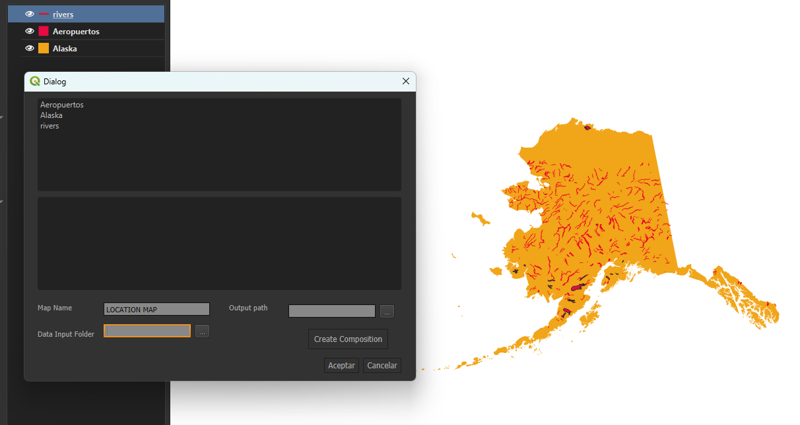
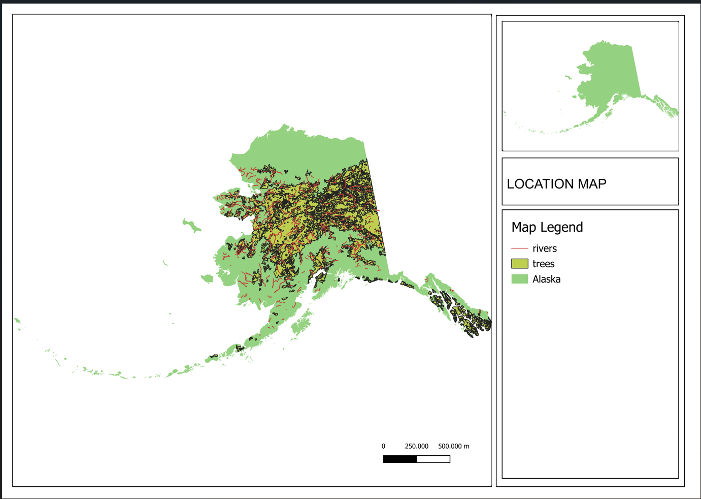

The main objective of this plugin is to generate a faster rendering of the active map layers. The created template is simple and can be adjusted to specific needs by adding new items with PyQGIS. Currently, the code is functional and is in the debugging phase.

